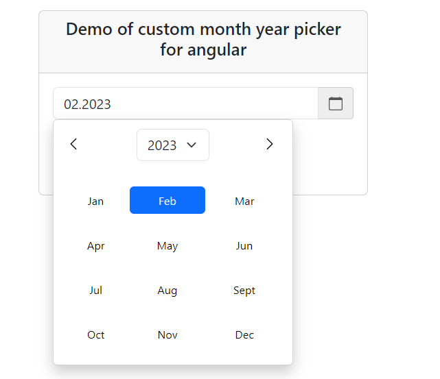

# Introduction

An angular application to use the custom picker for month and year

## Demo

`@my-custom-month-year-picker` Demo:



## Design Considerations

The primary application of this module is to view a custom month year picker and able to select any month with a year. There was no simple month year picker provided by ng-bootstrap which suited the specific usage i need for a project hence created a simple one.

## Developing

This project was developed using the NodeJS version 18 and angular 16. You may experience problems using older versions.

Once you have cloned the repository, install all packages using `npm`:

```
npm install
```
